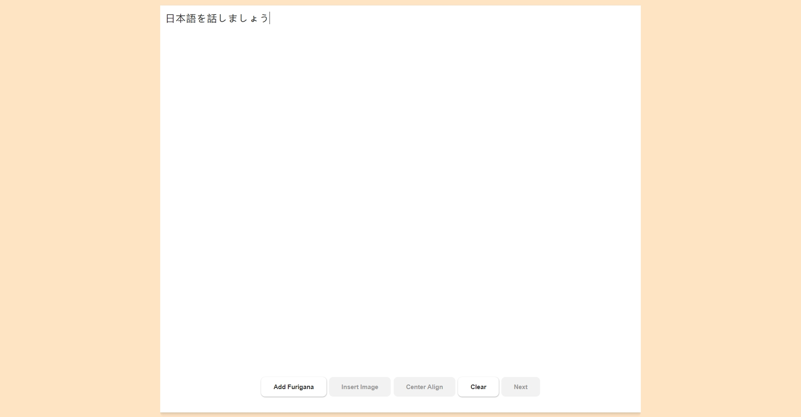
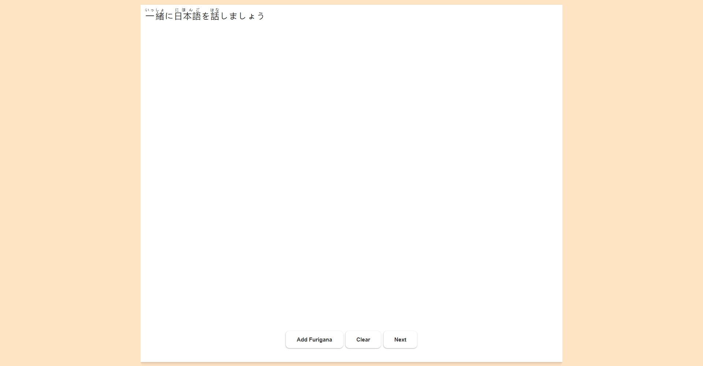
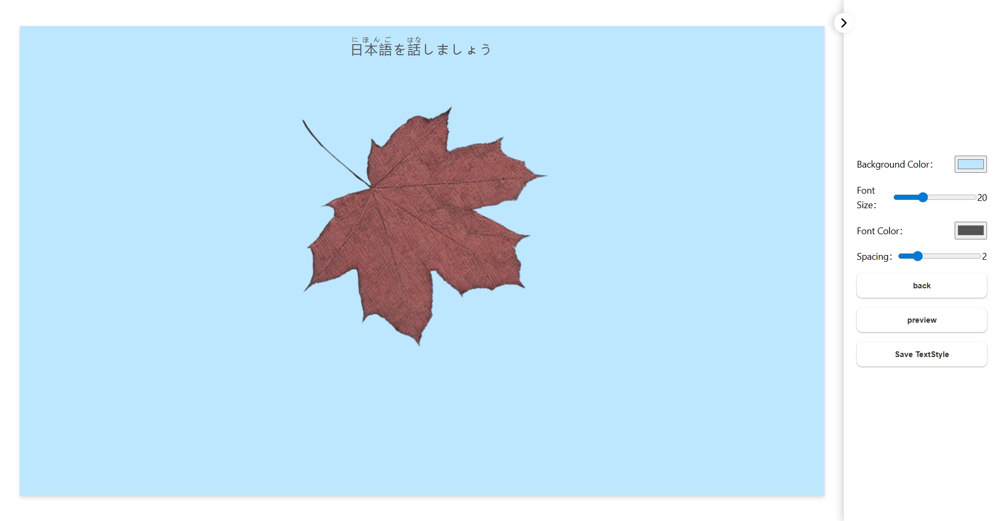

# Furigana Formatter

**Furigana Formatter** is a simple desktop tool designed for Japanese learners.  
It helps you read Japanese text by adding **romaji (romanized pronunciation)** to kanji characters.

## Features

- Convert Japanese sentences into annotated format with **furigana** (pronunciation guide).
- Display **romaji** above kanji characters to make reading easier.
- Clean and minimal UI designed for beginners.

## Who is it for?

If you're just starting to learn Japanese and struggle with kanji, this tool can assist you in reading and understanding texts more smoothly.

## Platform

- Desktop application built with [Electron](https://www.electronjs.org/)
- Works on Windows, macOS, and Linux

## Download

- https://github.com/Mooson58/FuriganaFormatter/tags

## Screenshot

## License

MIT
